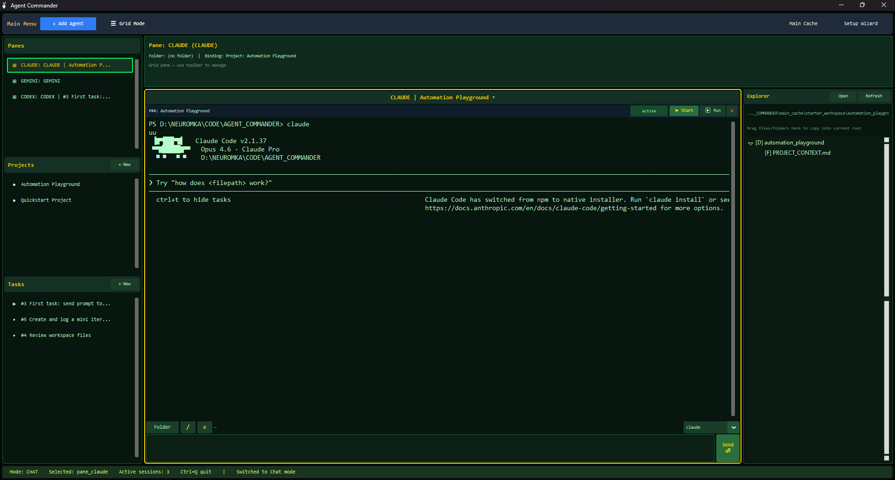
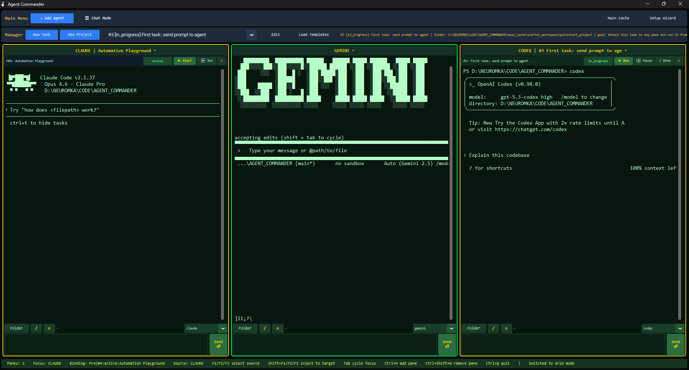

# Agent Commander

Agent Commander is a desktop GUI for managing multiple AI coding agents (Codex, Claude Code, Gemini CLI) in one place: agent panes, tasks, projects, chat mode, file explorer, and iteration workflows.

This repository is currently focused on the first public version for testing and feedback.

## v1 Features

- Chat Mode by default (main user flow).
- Grid Mode for side-by-side multi-agent monitoring.
- Agent panes with terminal, agent selector, and working folder picker.
- Task and project manager (create, edit, delete, starter templates).
- Task/project to pane binding.
- Project context flow via `PROJECT_CONTEXT.md`.
- Chat Mode file explorer (including basic drag and drop).
- Setup Wizard and preflight checks for available agent CLIs.

## Screenshots

### Chat Mode



### Grid Mode



## System Requirements

- OS: Windows 10/11 (primary target for current version).
- Python: **3.10+** (Python 3.12 recommended).
- Internet access: required on first launch to install Python dependencies.
- Agent access:
  - Codex: requires an OpenAI account.
  - Gemini CLI: requires a Google account with Gemini access.
  - Claude Code: requires a paid Anthropic subscription.

## Quick Start

1. Install Python 3.10+ and ensure `py` or `python` is available in PATH.
2. Clone or download this repository.
3. Run `run_agent_commander.bat` (double click).

The launcher will:
- create a local `.venv` if missing,
- install dependencies from `requirements.txt` on first run (or when requirements change),
- run preflight checks,
- start the app.

Setup only (without starting GUI):

```bat
run_agent_commander.bat --setup-only
```

## How to Use

### 1. Create an Agent Pane

1. Click `+ Add Agent` in the top menu.
2. In the new pane, choose an agent in the dropdown (`claude` / `gemini` / `codex`).
3. Optionally set a working folder using `Folder`.

### 2. Create a Task

1. In Manager, click `New Task`.
2. Fill in `Title` and optionally `Folder`, `Goal`, `Status`, `Priority`.
3. Click `Create`.
4. In Chat Mode, open the task from `Tasks` and use:
- `Run` to send task context to the agent,
- `Pause` / `Done` to update status,
- `Edit` / `Delete` to modify or remove the task.

### 3. Create a Project

1. In Manager, click `New Project`.
2. Fill in `Name`, `Folder`, `Description`, and project instructions for `PROJECT_CONTEXT.md`.
3. Click `Create`.
4. In Chat Mode, open the project from `Projects` and use:
- `Start` to enter the project flow and initialize agent context,
- `Run` to request/continue an iteration prompt,
- `Edit` / `Delete` to modify or remove the project.

### 4. UI Modes

- `Chat Mode` (default): sidebar + preview card + active pane + explorer.
- `Grid Mode`: all panes visible side by side.

## Data and Notes

- Manager data is stored in `main_cache/orchestrator.db`.
- Starter templates may be loaded automatically on first empty launch.
- The launcher installs dependencies automatically, but Python itself must already be installed.

## Feedback

Issues and UX feedback are welcome as we prepare for wider open-source testing.
